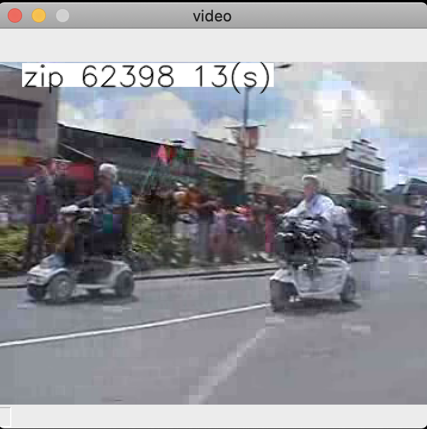
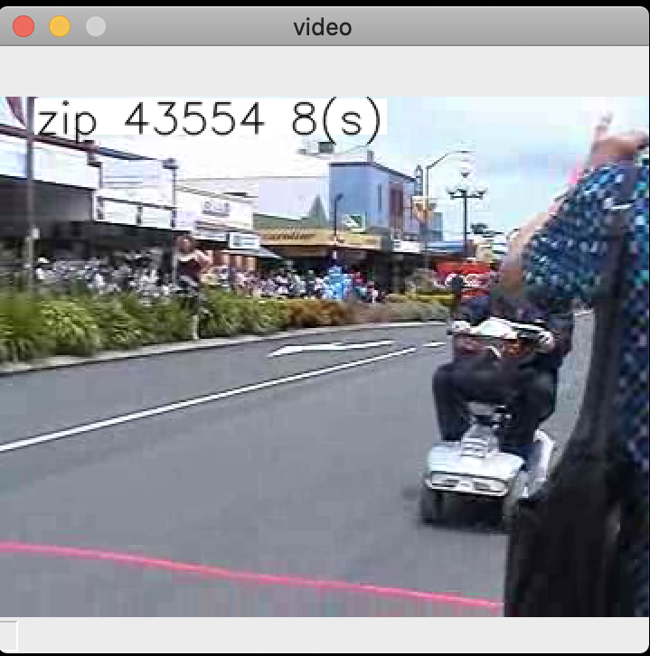

## Introduction

The following ad (https://www.youtube.com/watch?v=gBWLm6Sx1WI) from Cadbuty India started circulating around on social media during Diwali 2020 in India. The ad highlights how Cadbury's was able to help local vendors by customizing its ad to show location specific vendor information in the advertisement.

The follow code show how that can be built with Python and OpenCV.

While the ad mentions use of sophisticaed AI, it does not really need much ML or AI. OpenCV does the heavy lifting of video processing, no doubt, but still it does not use the Computer Vision aspects of OpenCV. 

Cadbury's seems to have generated various versions of the ad for optimal delivery (maybe from a CDN) and they may have used ML to determine the optimal combinations of vendors to generate videos for.

As such, the technique of figuring out a zip code (pin code), mapping it to a database and showing vendors in that locality, and then showing the vendors name at a specific time/frame in the video and for a specific duration, can all be done without needing AI or ML.

In this example, the following has been implemented:
* The following video is used: https://www.mediacollege.com/video-gallery/testclips/20051210-w50s.flv
  * This is obtained by an online OpenCV/Python example
* A random zip code is generated
* Random start time and stop time are generated
* The video is loaded and played back and as it does that, when the playback time hits the start time, a label with the zip code generated is shown

## Requirements

Python 3.8

## Installation

Instructions are for the command line, and has been tested on a Mac.

* Open a terminal and ensure python is installed and available

`python --version`

* Create a virtual environment

`python -m venv venv`

* Activate virtual environment

`source venv/bin/activate`

In Windows, try

`.\venv\Scripts\activate`

* Install dependencies

`pip install -r requirements.txt

## Run the program

`python opencv_example.py`

## Example screenshot

